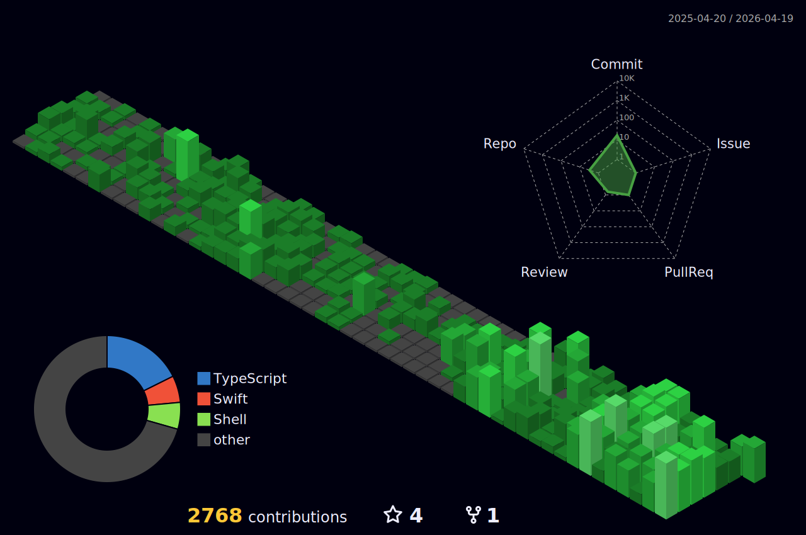

### Hi, I'm Kris Chase 👋

With more than 25 years of experience, I have become a leader in building teams and award winning digital experiences, through web development, IoT and apps. That’s not a brag, it’s a promise: to deliver tomorrow’s technology solutions — today. I'm currently serving as Fractional CTO for multiple SaaS products and technology companies.

- 💬  Ask me about AI, Web development, App Development, IoT, Automation and Security.

### 💼 Where I'm currently working at/as
- [Open World: Freelance](https://krischase.com)
- [Exfluential: CTO](https://exfluential.com) 💼 
- [BlancoLabel: CTO](https://blancolabel.io) 💼 
- [Iverson: Head of Engineering](https://iverson.inc) 💼 

### 💻 What I'm currently/done working on
- [StayHomeStaySane](https://stayhomestaysane.com)  🚀
- [Kris & Rachael Get Married](https://krisandrachael.com/)  💍
- [Devin Chase CNOA](https://devinchasecnoa.com/)  👮

### 📖 What I'm currently learning
- App Development
- AI & Machine Learning
- Cybersecurity and Ethical Hacking

### 📫 Where to find me
- [hey@krischase.com](mailto:hey@krischase.com) 📫
- [Facebook](https://facebook.com/mehh.kris) 😏
- [Twitter](https://twitter.com/chaseebadkids) 🐤
- [Instagram](https://instagram.com/imkrischase) 😎
- [LinkedIn](https://www.linkedin.com/in/krisrchase/) 👨💼
- [Website](https://krischase.com) 😏🔗

